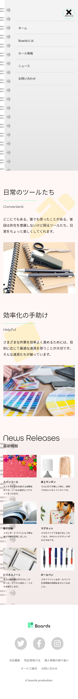

<!-- AUTO-GENERATED-CONTENT:START (STARTER) -->
<h1 align="center">
   Fictitious site
</h1>
This site is a fictitious site.

## Image Gallery
0.  **Load Page**
 
1.  **Top Page**

     
     

2.  **Nav Page**

    

## Description

This is a fictional site for a stationary Shop, created in HTML.
We set up an animation of a balloon illustration passing over the entire page when it loads.
## What's inside?

A quick look at the top-level files and directories you'll see in a HTML project.

    .
    ├── css
    ├── images
    ├── js
    ├── sass
    ├── README.md
    ├── gulpfile.js
    ├── gatsby-node.js
    ├── index.html
	├── package.json
    └── README.md

<!-- AUTO-GENERATED-CONTENT:END -->
